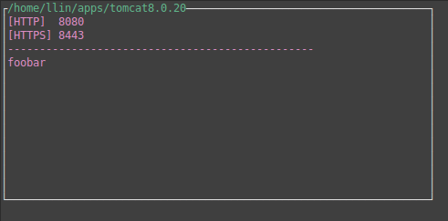

Which Tomcat?
=============



Getting started
===============

Prerequisite
------------

You need to install:

* [Go](http://golang.org/) (obviously)
* [Godeps](https://github.com/tools/godep) for dependency management

Install
-------

```
$ go get github.com/l-lin/whichtomcat
$ cd $GOPATH/src/github.com/l-lin/whichtomcat
$ godep go install
$ go install
```
